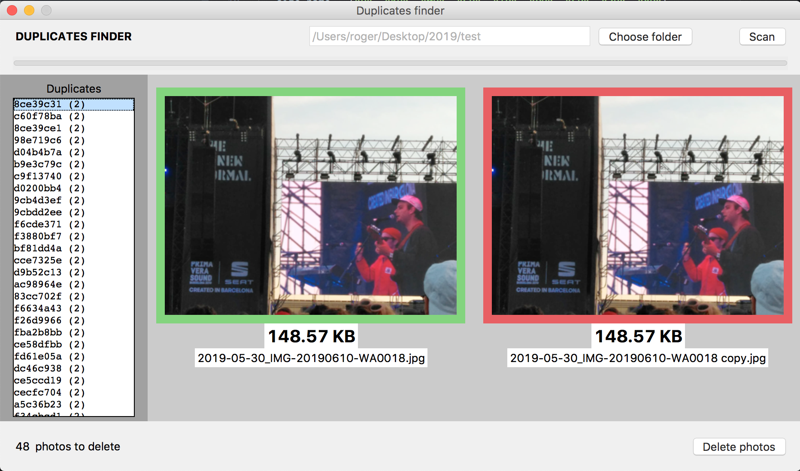

# Image-duplicate-finder-and-remover-GUI
Made with python using imagehash and tkinter

I made this to delete duplicate photos that are the same but were resized (mostly to remove the ones sent via whatsapp that are a compress version of the original ones I took). To do this I use perceptual hashing (pHash) and join if its hamming distance is small (they are almost identical).
I takes some time to compute if there are a lot of images on the folder selected --> O(n2) time complexity.

## Screenshot

